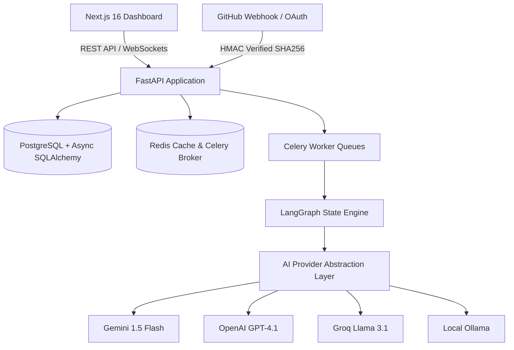
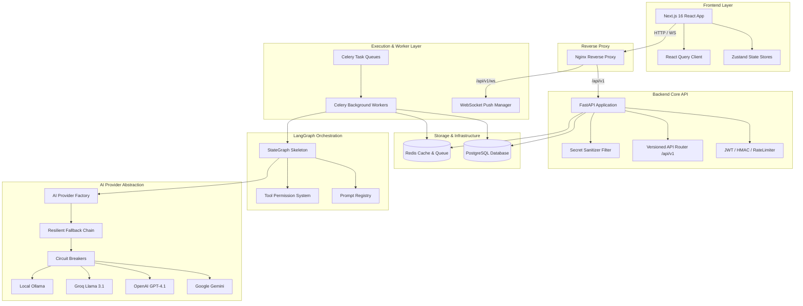
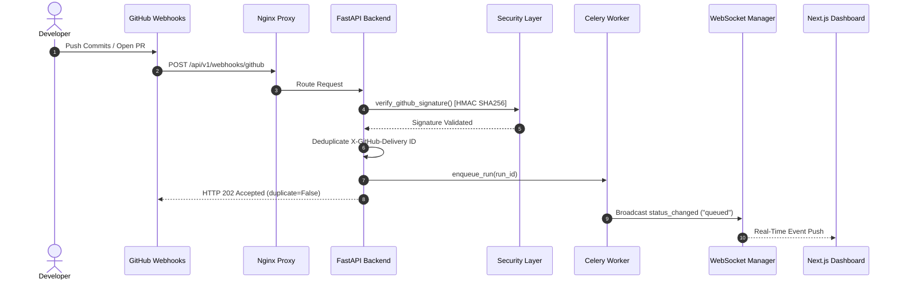
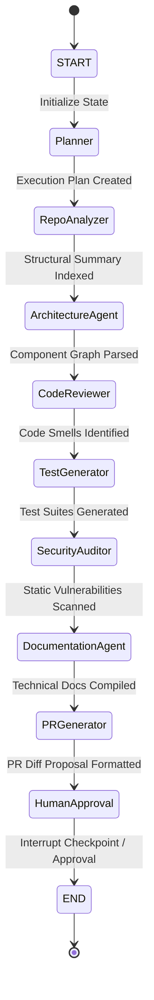
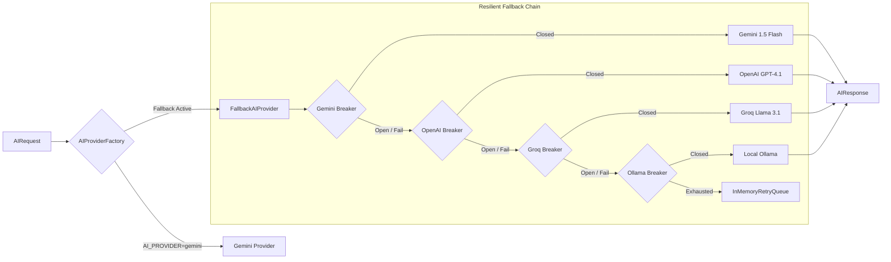
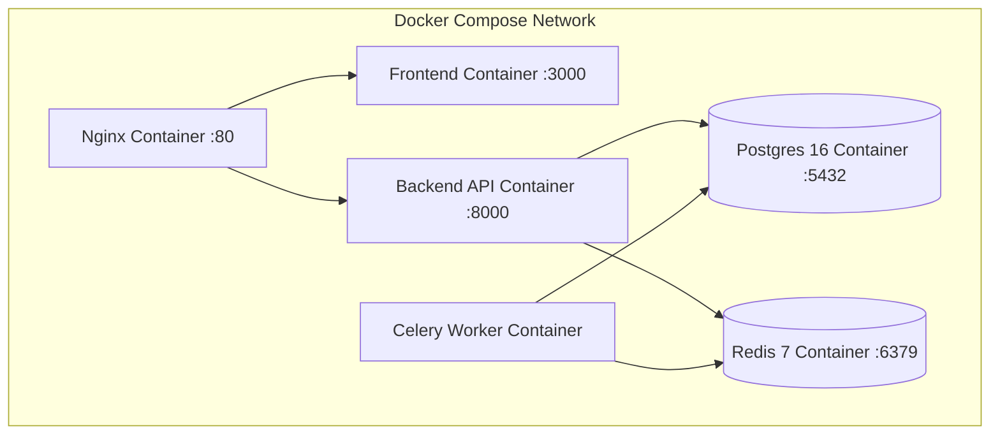

# Autonomous Software Engineering Platform

> An enterprise-grade, state-orchestrated software engineering platform that autonomously ingests GitHub repositories, constructs execution plans, reviews code, runs security audits, and manages multi-agent reasoning.


---

## 📚 Documentation

- 📖 Installation Guide → [docs/INSTALLATION_GUIDE.md](docs/INSTALLATION_GUIDE.md)
- 🏗 Architecture → [docs/ARCHITECTURE.md](docs/ARCHITECTURE.md)
- 🧑💻 Developer Guide → [docs/DEVELOPER_GUIDE.md](docs/DEVELOPER_GUIDE.md)
- 🔌 API Reference → [docs/API_REFERENCE.md](docs/API_REFERENCE.md)
- 🧩 Feature Matrix → [docs/FEATURE_MATRIX.md](docs/FEATURE_MATRIX.md)
- 🚀 Deployment → [docs/DEPLOYMENT_RUNBOOK.md](docs/DEPLOYMENT_RUNBOOK.md)
- 🛠 Troubleshooting → [docs/TROUBLESHOOTING.md](docs/TROUBLESHOOTING.md)
- 🤝 Contributing → [docs/CONTRIBUTING.md](docs/CONTRIBUTING.md)
- 📜 Changelog → [docs/CHANGELOG.md](docs/CHANGELOG.md)

---

## Table of Contents

- [Overview](#overview)
- [Key Features](#key-features)
- [Demo](#demo)
- [System Architecture](#system-architecture)
- [Technology Stack](#technology-stack)
- [AI Architecture](#ai-architecture)
- [Repository Analysis Pipeline](#repository-analysis-pipeline)
- [LangGraph Workflow](#langgraph-workflow)
- [Security](#security)
- [Project Structure](#project-structure)
- [Installation](#installation)
- [Configuration](#configuration)
- [Running the Project](#running-the-project)
- [API Overview](#api-overview)
- [Frontend](#frontend)
- [Observability](#observability)
- [Testing](#testing)
- [CI/CD](#cicd)
- [Performance](#performance)
- [Roadmap](#roadmap)
- [Contributing](#contributing)
- [License](#license)
- [Acknowledgements](#acknowledgements)

---

## Overview

### Problem Statement
Modern software engineering teams spend thousands of hours manually reviewing pull requests, hunting security vulnerabilities, analyzing repository architecture, writing documentation, and generating boilerplate test suites. Existing chatbot solutions lack stateful context, repository-level deterministic analysis, and multi-agent coordination.

### Mission
The **Autonomous Software Engineering Platform** replaces ad-hoc chatbot prompts with a **state-based orchestration platform**. Connected to GitHub repositories via secure webhooks, the platform deterministically indexes repository structure, parses AST targets, executes static security scanners, and coordinates specialized AI agents using **LangGraph**.

### Target Audience
- **Enterprise Engineering Teams**: Automate code reviews, security audits, and documentation generation.
- **DevOps & Security Engineers**: Enforce static analysis (Ruff, Bandit, Semgrep, Radon) and secret redaction policies.
- **AI SaaS Architects**: Reference implementation for multi-provider LLM abstraction, circuit breaking, key rotation, and LangGraph orchestration.

### High-Level Architecture


---

## Key Features

### Core Platform
- **State-Based Multi-Agent Orchestration**: LangGraph `StateGraph` skeleton coordinating 9 specialized agent roles.
- **Versioned Prompt Registry**: Central prompt template engine (`PromptRegistry`) loading versioned text prompts (`planner_v1`, `repo_analyzer_v1`) with variable validation. Zero hardcoded prompt strings.
- **Declarative Tool Permissions**: Central `ToolPermissionManager` enforcing agent-to-tool allowlists. Unauthorized tool calls raise HTTP 403 `ToolPermissionDeniedError`.

### AI Provider Abstraction
- **Multi-Provider Unified Interface**: `BaseAIProvider` abstraction with `HttpChatProvider` handling synchronous, streaming, and Pydantic structured output.
- **Dynamic Factory**: Switch LLM providers via `AI_PROVIDER` (`gemini`, `openai`, `groq`, `ollama`) without code changes.
- **Resilient Fallback Chain**: Automatic failover sequence: **Gemini → OpenAI → Groq → Ollama → Retry Queue**.
- **Circuit Breaker State Machine**: In-memory 3-state breaker (`CLOSED`, `OPEN`, `HALF_OPEN`) tracking failure thresholds and cooldown probes per provider.
- **API Key Rotation**: Round-robin `ApiKeyRing` cycling through multiple provider credentials.
- **Token Budget Accounting**: Per-run and per-user token and USD cost accounting with automatic limit tripping.

### Repository Analysis Engine
- **Deterministic Summarization**: Multi-layer repository context builder with Redis SHA-keyed caching (`RepositorySummarizer`).
- **AST Target Discovery**: Tree-sitter target identifier (`TreeSitterAstService`) and Python AST import/symbol extractor (`ImportGraphService`).
- **GitPython Metadata**: Recent commit summaries and contributor metadata collection (`GitHistoryService`).
- **Static Analysis Wrappers**: Safe subprocess execution (`shell=False`) for Ruff, Bandit, Semgrep, and Radon.

### Security & Hardening
- **Secret Sanitizer**: Regex filter redacting API keys (`sk-...`, `gsk_...`), GitHub tokens (`ghp_...`), Bearer tokens, and JWTs across logs, exceptions, and AI payloads.
- **GitHub Webhook Verification**: Constant-time HMAC SHA256 signature check (`verify_github_signature`) and `X-GitHub-Delivery` idempotency deduplication.
- **JWT & Role-Based Access Control**: JWT token encoding/decoding and role hierarchy dependencies (`OWNER` > `ADMIN` > `MEMBER` > `VIEWER`).
- **Rate Limiting**: Sliding window token bucket middleware (`RateLimiter`) enforcing request limits per IP.
- **HTTP Security Headers**: Enforced Helmet-equivalent response headers (`nosniff`, `DENY`, `1; mode=block`, `HSTS`).
- **Append-Only Audit Logger**: In-memory `AuditLogger` tracking state-changing operations with sanitized metadata.

### Frontend Dashboard
- **Next.js 16 App Router**: Dark mode by default (`#0B0F17`), glassmorphism backdrop blur filters, glowing gradient borders, and responsive grid layouts.
- **State Management**: Zustand stores (`useAuthStore`, `useRepoStore`) and React Query provider (`QueryProvider`).
- **Repository List**: Interactive grid displaying active status badges, commit SHAs, default branches, and launch triggers.
- **Cost & Model Health Panel**: Real-time telemetry dashboard streaming provider circuit breaker states, token usage, cost USD, and audit counters.

### DevOps & Observability
- **Production Dockerization**: Multi-stage Dockerfiles for backend API, Celery worker, and Next.js frontend.
- **Local Container Orchestration**: `docker-compose.yml` linking PostgreSQL, Redis, Backend, Worker, Frontend, and Nginx.
- **Nginx Reverse Proxy**: Reverse proxy routing `/api/v1` and WebSocket traffic to FastAPI and `/` to Next.js.
- **Prometheus Telemetry**: `/api/v1/metrics/prometheus` plaintext exporter and `/api/v1/telemetry/health` JSON endpoint.
- **GitHub Actions CI/CD**: 6-stage pipeline enforcing linting → type checking → unit testing → golden regression → security scanning → container builds.

---

## Demo

> [!NOTE]
> Visual demonstration artifacts and recorded media walkthroughs are available below.

### Application Shell & Repository Grid
``

### Real-Time Telemetry & Circuit Breaker Health
``

### Architecture Overview Diagram
``

### Demo Video Walkthrough
``

---

## System Architecture

### High-Level Architecture


### Request & Webhook Flow


### LangGraph Agent Workflow


### AI Provider Abstraction & Fallback Chain


### Deployment Architecture


---

## Technology Stack

| Category | Technology | Version | Purpose |
| :--- | :--- | :--- | :--- |
| **Frontend Framework** | Next.js (App Router) | `16.2.12` | Server-rendered & client-side React dashboard framework |
| **Frontend UI & Styling** | Tailwind CSS + Lucide Icons | `4.0.0` | Custom dark mode design tokens, glassmorphism, responsive grid |
| **Frontend State** | Zustand + React Query | `5.0.0` / `5.66.0` | Global UI state management and server-state caching |
| **Backend Framework** | FastAPI | `0.111.0` | Async Python REST API engine with OpenAPI generation |
| **AI Orchestration** | LangGraph | `0.2.0` | State-based multi-agent graph execution framework |
| **LLM Provider APIs** | Google Gemini, OpenAI, Groq, Ollama | Native REST | Chat completions, streaming, and Pydantic structured output |
| **Database ORM** | Async SQLAlchemy + AsyncPG | `2.0.31` | Async PostgreSQL ORM and connection pooling |
| **Database Migrations** | Alembic | `1.13.2` | Version-controlled database schema migrations |
| **Cache & Task Queue** | Redis | `5.0.7` | Repository summary caching and Celery message broker |
| **Async Task Workers** | Celery | `5.4.0` | Distributed background task execution and dead-letter queues |
| **Security & Auth** | PyJWT + Passlib + HMAC | `2.8.0` | JWT tokens, bcrypt password hashing, GitHub webhook signatures |
| **Static Code Analysis** | GitPython, Ruff, Bandit, Semgrep, Radon | Latest | AST target discovery, static linting, security scans, and complexity |
| **Reverse Proxy** | Nginx | `Alpine` | HTTP/WebSocket routing, rate limiting, and SSL termination |
| **Containerization** | Docker + Docker Compose | `24.0+` | Multi-stage production container builds and local dev orchestration |
| **Telemetry & Metrics** | Prometheus Client | `0.26.0` | Prometheus plaintext metric exporter and telemetry health API |
| **Testing Framework** | Pytest + Pytest AsyncIO | `9.1.1` | Unit, integration, API, and golden regression testing |

---

## AI Architecture

### Provider Abstraction & Factory Pattern
The platform isolates model invocation behind `BaseAIProvider` ([backend/app/ai/base.py](backend/app/ai/base.py)). No business logic or agent module interacts with vendor SDKs directly. `HttpChatProvider` ([backend/app/ai/http_provider.py](backend/app/ai/http_provider.py)) provides OpenAI-compatible REST communication across:
- **GeminiProvider**: Uses Google's OpenAI-compatible endpoint (`/v1beta/openai`).
- **OpenAIProvider**: Uses OpenAI v1 API endpoints.
- **GroqProvider**: Uses Groq's high-speed inference endpoints.
- **OllamaProvider**: Uses local Ollama instance (`http://localhost:11434/v1`).

Selecting the active provider requires zero code changes via `AI_PROVIDER` in `.env`.

### Fallback Chain & Circuit Breakers
When primary provider failures (rate limits, 5xx server errors, network timeouts) occur, `FallbackAIProvider` ([backend/app/ai/fallback.py](backend/app/ai/fallback.py)) executes an automatic failover:

$$\text{Gemini} \longrightarrow \text{OpenAI} \longrightarrow \text{Groq} \longrightarrow \text{Ollama} \longrightarrow \text{InMemoryRetryQueue}$$

Each provider is guarded by an independent `CircuitBreaker` ([backend/app/ai/circuit_breaker.py](backend/app/ai/circuit_breaker.py)) featuring:
- **CLOSED**: Requests flow normally; failure counter increments on errors.
- **OPEN**: Trips open when failure count reaches `ai_circuit_failure_threshold` (default 3); requests immediately failover without network pings.
- **HALF_OPEN**: After `ai_circuit_cooldown_seconds` (default 30s), a probe request evaluates provider recovery.

### Prompt Registry & Tool Permission System
- **Prompt Registry** ([backend/app/agents/prompts/registry.py](backend/app/agents/prompts/registry.py)): Manages prompt templates stored as versioned text files under `app/agents/prompts/templates/`. Loads and formats templates dynamically with strict variable validation.
- **Tool Permission System** ([backend/app/agents/permissions.py](backend/app/agents/permissions.py)): Central allowlist (`AGENT_TOOL_ALLOWLIST`) enforcing declarative tool execution bounds per agent role.

### Structured Outputs & Guardrails
- **Structured Outputs**: `parse_json_with_retry` ([backend/app/ai/structured.py](backend/app/ai/structured.py)) enforces Pydantic schema validation. If an LLM returns malformed JSON, the helper re-prompts with a strict format instruction before throwing an exception.
- **Token Budget Manager**: `TokenBudgetManager` ([backend/app/ai/budget.py](backend/app/ai/budget.py)) enforces per-run and per-user token and USD cost ceilings, preventing runaway agent loops.

---

## Repository Analysis Pipeline

The repository analysis pipeline converts raw codebase content into deterministic structural context:

```
Repository Source Code
  │
  ├─► DirectoryTreeService ────► Filter out sensitive files (.env, .pem, id_rsa)
  │
  ├─► ReadmeService ───────────► Extract README overview & guidelines
  │
  ├─► TreeSitterAstService ────► Discover AST parse targets across languages
  │
  ├─► ImportGraphService ─────► Parse Python AST imports & top-level symbols
  │
  ├─► GitHistoryService ──────► Collect recent commit SHAs & author metadata
  │
  └─► StaticAnalysisService ───► Run Ruff, Bandit, Semgrep, Radon (shell=False)
  │
  ▼
RepositorySummarizer ─────────► Synthesize JSON Summary & Cache in Redis (Key: SHA)
  │
  ▼
LangGraph State Engine ───────► Consume Summary in Autonomous Agent Nodes
```

---

## LangGraph Workflow

The platform defines a 9-node `StateGraph` skeleton ([backend/app/agents/graph.py](backend/app/agents/graph.py)) executing the following roles:

| Agent Node | Implementation Status | Primary Responsibility |
| :--- | :--- | :--- |
| **Planner** | 🟡 Partial | Analyzes repo summary and commit SHA to construct structured execution plan. |
| **Repository Analyzer** | 🟡 Partial | Indexes directory trees, import graphs, and symbol inventories. |
| **Architecture Agent** | 🟡 Partial | Evaluates component coupling, design patterns, and structural risks. |
| **Code Reviewer** | 🟡 Partial | Reviews static analysis reports (Ruff, Radon) to identify bugs and code smells. |
| **Test Generator** | 🟡 Partial | Formulates runnable Pytest test suites based on symbol signatures. |
| **Security Auditor** | 🟡 Partial | Analyzes static security scans (Bandit, Semgrep) for vulnerabilities. |
| **Documentation Agent** | 🟡 Partial | Compiles technical documentation, API guides, and changelogs. |
| **PR Generator** | 🟡 Partial | Formulates Pull Request proposals and file edit diffs. |
| **Human Approval** | 🟡 Partial | Interrupt checkpoint pausing execution for explicit human authorization. |

---

## Security

- **JWT Authentication**: 32-byte secret validation, `HS256` token encoding/decoding, and expiration enforcement ([backend/app/core/security.py](backend/app/core/security.py)).
- **GitHub OAuth**: Secure OAuth authorization URL generation and callback code exchange ([backend/app/services/auth_service.py](backend/app/services/auth_service.py)).
- **Role-Based Access Control (RBAC)**: Role hierarchy (`OWNER` > `ADMIN` > `MEMBER` > `VIEWER`) enforced via `require_role(...)` FastAPI dependencies.
- **Webhook Verification**: Constant-time HMAC SHA256 signature verification (`verify_github_signature`) against configured webhook secret.
- **Prompt Injection & Secret Protection**: `SecretSanitizer` ([backend/app/core/sanitizer.py](backend/app/core/sanitizer.py)) redacts credentials, tokens, and keys from all logs, exception tracebacks, and LLM payloads.
- **Sandboxed Execution Safety**: Static tools run via `asyncio.create_subprocess_exec` with `shell=False`, strict execution timeouts, and path containment checks (`safe_relative_path`).
- **Rate Limiting**: Sliding window token bucket (`RateLimiter`) enforcing 120 requests/min per IP ([backend/app/core/security_hardening.py](backend/app/core/security_hardening.py)).
- **Audit Logging**: Append-only `AuditLogger` ([backend/app/core/audit.py](backend/app/core/audit.py)) tracking state-changing operations.

---

## Project Structure

```
.
├── .github/
│   ├── ISSUE_TEMPLATE/       # GitHub issue templates (bug, feature, question)
│   ├── workflows/            # GitHub Actions CI/CD pipeline
│   ├── CODEOWNERS            # Repository code ownership rules
│   └── PULL_REQUEST_TEMPLATE.md
├── backend/
│   ├── alembic/              # Database migration scripts & env
│   ├── app/                  # FastAPI routers, services, models, & AI abstraction
│   ├── tests/                # Pytest test suite (49 unit, API, & golden regression tests)
│   ├── .env.example          # Backend environment variable template
│   ├── Dockerfile            # Multi-stage production backend API image
│   └── pyproject.toml        # Backend dependencies & configuration
├── frontend/
│   ├── src/                  # Next.js 16 App Router UI components & state stores
│   ├── .env.example          # Frontend environment variable template
│   ├── Dockerfile            # Multi-stage production frontend image
│   └── package.json          # Frontend npm dependencies
├── docs/                     # Project technical documentation suite
│   ├── API_REFERENCE.md      # OpenAPI REST & WebSocket specification
│   ├── ARCHITECTURE.md       # High-level architecture blueprint & ER diagrams
│   ├── CHANGELOG.md          # Release history and unreleased features
│   ├── CONTRIBUTING.md       # Contribution guidelines & extension guides
│   ├── DEPLOYMENT_RUNBOOK.md # Operations and deployment runbook
│   ├── DEVELOPER_GUIDE.md    # Developer onboarding & architectural walkthrough
│   ├── FEATURE_MATRIX.md     # Implementation status comparison matrix
│   ├── INSTALLATION_GUIDE.md # Step-by-step installation guide
│   └── TROUBLESHOOTING.md   # Searchable diagnostic troubleshooting guide
├── nginx/
│   └── nginx.conf            # Reverse proxy configuration
├── .editorconfig             # IDE code formatting configuration
├── .gitignore                # Enterprise-grade Git ignore rules
├── docker-compose.yml        # Production local Docker Compose orchestration
├── LICENSE                   # MIT License
└── README.md                 # Primary project documentation
```

---

## Installation

### Prerequisites
- **Python**: `3.11` or higher
- **Node.js**: `20.x` or higher
- **Docker Engine**: `24.0+` & **Docker Compose**: `2.20+`

### Step 1: Clone Repository
```bash
git clone https://github.com/enterprise-org/autonomous-se-platform.git
cd autonomous-se-platform
```

### Step 2: Configure Environment Variables
```bash
cp backend/.env.example backend/.env
cp frontend/.env.example frontend/.env
```

---

## Configuration

### Backend Environment Variables (`backend/.env`)

| Variable | Type | Default | Required | Description |
| :--- | :--- | :--- | :---: | :--- |
| `ENV` | `str` | `development` | Yes | Runtime environment (`development`, `production`) |
| `DATABASE_URL` | `str` | `postgresql+asyncpg://...` | Yes | Async PostgreSQL connection string |
| `REDIS_URL` | `str` | `redis://localhost:6379/0` | Yes | Redis connection string for cache & Celery broker |
| `SECRET_KEY` | `str` | `dev-only-change-me` | Yes | 32-character secret key for JWT signing |
| `WEBHOOK_SECRET` | `str` | `dev-webhook-secret` | Yes | Secret used for GitHub HMAC signature verification |
| `AI_PROVIDER` | `str` | `gemini` | Yes | Active primary LLM provider (`gemini`, `openai`, `groq`, `ollama`) |
| `GOOGLE_API_KEY` | `str` | `""` | Optional | Google Gemini API key |
| `MODEL_NAME` | `str` | `gemini-1.5-flash` | Optional | Default Gemini chat completions model |
| `OPENAI_API_KEYS` | `list` | `[]` | Optional | Comma-separated OpenAI API keys for rotation |
| `GROQ_API_KEYS` | `list` | `[]` | Optional | Comma-separated Groq API keys for rotation |

### Frontend Environment Variables (`frontend/.env`)

| Variable | Type | Default | Required | Description |
| :--- | :--- | :--- | :---: | :--- |
| `NEXT_PUBLIC_API_URL` | `str` | `http://localhost:8000/api/v1` | Yes | Base URL for FastAPI REST API endpoints |

---

## Running the Project

### Running with Docker Compose (Recommended)
```bash
docker-compose up --build -d
```
Access points:
- **Frontend Dashboard**: `http://localhost`
- **Backend Health Check**: `http://localhost/api/v1/health`
- **Prometheus Metrics**: `http://localhost/api/v1/metrics/prometheus`

### Running Locally for Development

#### 1. Backend Server
```bash
cd backend
python -m venv .venv
source .venv/bin/activate  # On Windows: .venv\Scripts\activate
pip install -e .[dev]
uvicorn app.main:app --reload --port 8000
```

#### 2. Celery Worker
```bash
cd backend
celery -A app.workers.celery_app worker --loglevel=info -Q runs,dead_letter
```

#### 3. Frontend App
```bash
cd frontend
npm install
npm run dev
```

---

## API Overview

The platform exposes versioned OpenAPI REST endpoints under `/api/v1`:

### Health & Observability
- `GET /api/v1/health`: Process readiness status.
- `GET /api/v1/health/db`: Database connectivity check.
- `GET /api/v1/metrics/prometheus`: Prometheus plaintext metrics format.
- `GET /api/v1/telemetry/health`: Aggregated JSON telemetry, circuit breaker states, and token cost stats.

### Authentication & Repositories
- `GET /api/v1/auth/github/start`: Get GitHub OAuth authorization URL.
- `POST /api/v1/auth/github/callback`: Exchange OAuth code for JWT token.
- `GET /api/v1/repositories`: List registered repositories (Paginated).
- `POST /api/v1/repositories`: Connect a new GitHub repository.

### Runs & Webhooks
- `POST /api/v1/webhooks/github`: Ingest HMAC SHA256 verified GitHub webhook events.
- `GET /api/v1/runs/repositories/{id}`: List execution runs for a repository.
- `POST /api/v1/runs`: Manually trigger an autonomous execution run.
- `WS /api/v1/ws/connect`: Authenticated WebSocket connection for real-time event broadcasting.

---

## Frontend

The frontend is built with Next.js 16 App Router and Tailwind CSS:
- **App Shell** ([frontend/src/components/layout/AppShell.tsx](frontend/src/components/layout/AppShell.tsx)): Primary application wrapper with sticky header navigation, repository badge selector, and status indicators.
- **Repository List** ([frontend/src/components/repositories/RepositoryList.tsx](frontend/src/components/repositories/RepositoryList.tsx)): Interactive grid displaying connected repositories, branch metadata, and one-click "Launch Run" triggers.
- **Cost Analytics & Model Health** ([frontend/src/components/analytics/AnalyticsPanel.tsx](frontend/src/components/analytics/AnalyticsPanel.tsx)): Real-time telemetry dashboard monitoring token usage, accrued cost USD, circuit breaker states per provider, diff verifications, and audit log entries.

---

## Observability

- **Structured Metrics**: Prometheus exporter exposing HTTP request latencies, token consumption, accrued USD costs, circuit breaker states, and guardrail counters ([backend/app/core/metrics.py](backend/app/core/metrics.py)).
- **Sanitized Logging**: `SecretSanitizer` ([backend/app/core/sanitizer.py](backend/app/core/sanitizer.py)) redacting credentials, tokens, and keys from all log records.
- **Audit Trails**: Append-only `AuditLogger` ([backend/app/core/audit.py](backend/app/core/audit.py)) recording user ID, action, resource, and timestamp.

---

## Testing

The platform includes a 49-test Pytest suite covering unit, integration, API, and golden regression testing.

### Running Backend Tests
```bash
cd backend
pytest -v
```

### Running Golden Regression Tests
```bash
cd backend
pytest tests/test_golden_regression.py -v
```

### Running Static Linters & Type Checks
```bash
cd backend
ruff check app tests
mypy app tests
```

---

## CI/CD

The GitHub Actions pipeline (`.github/workflows/ci-cd.yml`) enforces 6 sequential quality gates:

```
1. Linting (Ruff & ESLint)
       │
       ▼
2. Static Type Check (MyPy Strict & TypeScript build)
       │
       ▼
3. Unit & Integration Test Suite (Pytest)
       │
       ▼
4. Golden Set Output Regression Check (Pytest Golden Fixtures)
       │
       ▼
5. Security & Vulnerability Scan (Bandit AST & npm audit)
       │
       ▼
6. Production Container Build (Multi-Stage Docker Images)
```

---

## Performance

- **Asynchronous I/O**: FastAPI with `asyncio` and `asyncpg` connection pooling for non-blocking I/O.
- **Redis Context Caching**: Repository summaries cached in Redis keyed by commit SHA (`RepositorySummarizer`).
- **Subprocess Safety**: Static analysis tools run asynchronously via `asyncio.create_subprocess_exec` with timeouts and bounded concurrency.
- **Streaming Response Processing**: Provider abstraction supports async generator streaming (`StreamChunk`).

---

## Roadmap

The roadmap below is derived from deferred features in [docs/FEATURE_MATRIX.md](docs/FEATURE_MATRIX.md):

- [ ] **Persistent User Identity Flows**: Mature user record persistence and OAuth state CSRF validation (`AuthService.exchange_github_code()`).
- [ ] **Autonomous Orchestration Entrypoint**: Transition `enqueue_run()` placeholder into a full background agent run execution loop.
- [ ] **Tree-sitter Grammar Parsing**: Extend `TreeSitterAstService` with installed grammars for deep multi-language AST extraction.
- [ ] **Durable Redis Retry Queue**: Upgrade `InMemoryRetryQueue` to a persistent Redis-backed retry queue.

---

## Contributing

Please review [docs/CONTRIBUTING.md](docs/CONTRIBUTING.md) for details on code style, branch strategy, testing requirements, and pull request submissions.

---

## License

This project is licensed under the **MIT License**. See the [LICENSE](LICENSE) file for details.

---

## Acknowledgements

- **FastAPI**: Modern, fast web framework for building APIs with Python.
- **LangGraph**: Framework for building stateful, multi-actor applications with LLMs.
- **Next.js**: The React Framework for the Web.
- **Tailwind CSS**: Utility-first CSS framework.
- **SQLAlchemy & Alembic**: Database toolkit and migration framework for Python.
- **Prometheus Client**: Python client for Prometheus monitoring.
