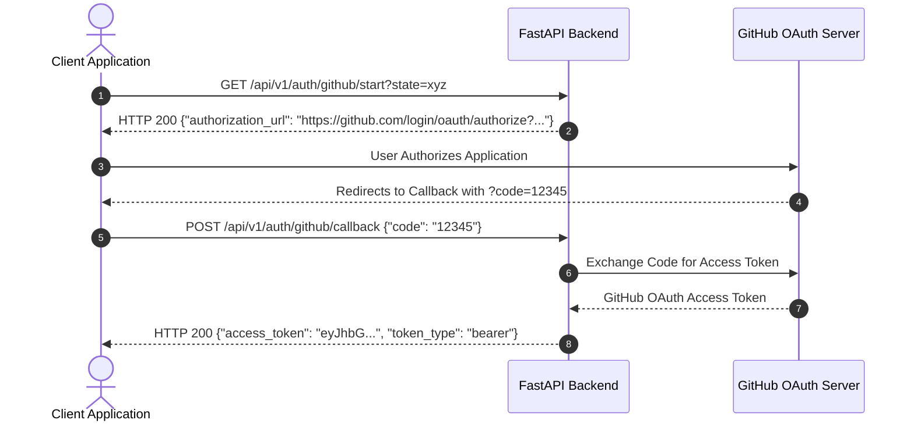

# Autonomous Software Engineering Platform: API Reference

> **API Version**: `v1`  
> **Base Path**: `/api/v1`  
> **OpenAPI Schema**: Available at `/api/v1/openapi.json`  
> **Interactive Documentation**: Swagger UI at `/api/v1/docs` | ReDoc at `/api/v1/redoc`

---

## Table of Contents
1. [Overview & Authentication](#1-overview--authentication)
2. [Global Error Structure](#2-global-error-structure)
3. [Pagination Specification](#3-pagination-specification)
4. [Rate Limiting Specification](#4-rate-limiting-specification)
5. [Endpoints Reference](#5-endpoints-reference)
   - [Health & System](#health--system)
   - [Telemetry & Observability](#telemetry--observability)
   - [Authentication](#authentication)
   - [Repositories](#repositories)
   - [Runs](#runs)
   - [Webhooks](#webhooks)
6. [WebSocket Interface](#6-websocket-interface)

---

# 1. Overview & Authentication

All REST endpoints are relative to the `/api/v1` base URL. Protected endpoints require a JSON Web Token (JWT) supplied in the `Authorization` HTTP header using the standard `Bearer` scheme.

### Authorization Header Format
```http
Authorization: Bearer <access_token>
```

### Authentication Flow (GitHub OAuth 2.0)


---

# 2. Global Error Structure

Errors returned by the platform conform to a standardized JSON error structure.

### Error Response Payload Schema (`ErrorResponse`)
```json
{
  "detail": "Detailed explanation of the error condition.",
  "code": "api_error"
}
```

### Standard HTTP Status Codes

| Status Code | Error Code | Description |
| :--- | :--- | :--- |
| `400 Bad Request` | `api_error` | Request payload or parameters are malformed or invalid. |
| `401 Unauthorized` | `api_error` | Missing, expired, or invalid JWT Bearer token. |
| `403 Forbidden` | `api_error` | Authenticated user lacks required role (`OWNER`, `ADMIN`, `MEMBER`, `VIEWER`). |
| `404 Not Found` | `api_error` | Requested resource (repository, run, user) does not exist. |
| `422 Unprocessable Entity` | `validation_error` | Pydantic request body validation failure. |
| `429 Too Many Requests` | `rate_limit_exceeded` | Client exceeded the rate limit threshold (120 req/min). |
| `500 Internal Server Error` | `internal_server_error` | Unhandled backend processing error. |

---

# 3. Pagination Specification

List endpoints return offset-based paginated results wrapped in a generic `Page[T]` payload.

### Pagination Query Parameters

| Parameter | Type | Default | Constraints | Description |
| :--- | :--- | :--- | :--- | :--- |
| `limit` | `integer` | `50` | `1 <= limit <= 100` | Maximum number of records to return. |
| `offset` | `integer` | `0` | `offset >= 0` | Index offset of the first record to return. |

### Paginated Response Schema (`Page[T]`)
```json
{
  "items": [],
  "total": 120,
  "limit": 50,
  "offset": 0
}
```

---

# 4. Rate Limiting Specification

The backend enforces per-IP sliding window rate limiting via middleware (`RateLimiter`).

- **Default Limit**: `120 requests per minute` per client IP address.
- **Exceeded Limit Response**: `HTTP 429 Too Many Requests`

---

# 5. Endpoints Reference

## Health & System

### `GET /api/v1/health`
Checks backend API process readiness.

- **Authentication**: None (Public)
- **Parameters**: None
- **Response**: `200 OK`
```json
{
  "status": "ok"
}
```

---

### `GET /api/v1/health/db`
Checks PostgreSQL database connection health.

- **Authentication**: None (Public)
- **Parameters**: None
- **Response**: `200 OK`
```json
{
  "status": "ok"
}
```

---

## Telemetry & Observability

### `GET /api/v1/metrics/prometheus`
Exposes raw plaintext Prometheus telemetry metrics.

- **Authentication**: Required (`ADMIN` role)
- **Parameters**: None
- **Response**: `200 OK` (`text/plain; version=0.0.4; charset=utf-8`)
```prometheus
# HELP process_cpu_seconds_total Total user and system CPU time spent in seconds.
# TYPE process_cpu_seconds_total counter
process_cpu_seconds_total 12.45
# HELP ai_provider_requests_total Total requests sent to AI providers.
# TYPE ai_provider_requests_total counter
ai_provider_requests_total{provider="gemini",status="success"} 42
```

---

### `GET /api/v1/telemetry/health`
Returns aggregated JSON AI provider health states, token costs, and security audit counts.

- **Authentication**: Required (`ADMIN` role)
- **Parameters**: None
- **Response**: `200 OK`
```json
{
  "status": "healthy",
  "providers": {
    "groq": { "state": "closed", "failure_count": 0, "latency_ms": 120 },
    "openai": { "state": "closed", "failure_count": 0, "latency_ms": 240 },
    "ollama": { "state": "closed", "failure_count": 0, "latency_ms": 15 }
  },
  "telemetry": {
    "total_tokens_consumed": 42500,
    "total_cost_usd": 0.085,
    "guardrail_violations": 0,
    "hallucination_verifications": 12,
    "audit_events_recorded": 15
  }
}
```

---

## Authentication

### `GET /api/v1/auth/github/start`
Generates the GitHub OAuth 2.0 authorization URL.

- **Authentication**: None (Public)
- **Query Parameters**:
  - `state` (`string`, optional): Opaque state parameter for CSRF mitigation.
- **Response**: `200 OK`
```json
{
  "authorization_url": "https://github.com/login/oauth/authorize?client_id=YOUR_CLIENT_ID&redirect_uri=http%3A%2F%2Flocalhost%3A3000%2Fapi%2Fauth%2Fcallback&scope=user%3Aemail+repo&state=xyz"
}
```

---

### `POST /api/v1/auth/github/callback`
Exchanges a GitHub OAuth callback authorization code for a platform JWT.

- **Authentication**: None (Public)
- **Request Body**:
```json
{
  "code": "837492a8e7b10294821a",
  "state": "xyz"
}
```
- **Response**: `200 OK`
```json
{
  "access_token": "eyJhbGciOiJIUzI1NiIsInR5cCI6IkpXVCJ9...",
  "token_type": "bearer"
}
```

---

## Repositories

### `GET /api/v1/repositories`
Lists connected GitHub repositories with offset-based pagination.

- **Authentication**: Required (`VIEWER` role or higher)
- **Query Parameters**:
  - `limit` (`integer`, default `50`): Max records to return.
  - `offset` (`integer`, default `0`): Pagination offset.
- **Response**: `200 OK`
```json
{
  "items": [
    {
      "id": "repo-91028471",
      "github_repo_id": "84729102",
      "owner": "enterprise-org",
      "name": "autonomous-se-platform",
      "default_branch": "main",
      "clone_url": "https://github.com/enterprise-org/autonomous-se-platform.git",
      "is_active": true,
      "created_at": "2026-07-28T09:00:00Z"
    }
  ],
  "total": 1,
  "limit": 50,
  "offset": 0
}
```

---

## Runs

### `GET /api/v1/runs/repositories/{repository_id}`
Lists execution runs for a specific repository.

- **Authentication**: Required (`VIEWER` role or higher)
- **Path Parameters**:
  - `repository_id` (`string`, required): Repository UUID.
- **Query Parameters**:
  - `limit` (`integer`, default `50`): Max records to return.
  - `offset` (`integer`, default `0`): Pagination offset.
- **Response**: `200 OK`
```json
{
  "items": [
    {
      "id": "run-a8192304",
      "repository_id": "repo-91028471",
      "event_type": "push",
      "status": "completed",
      "commit_sha": "a1b2c3d4e5f678901234567890abcdef12345678",
      "branch": "main",
      "webhook_delivery_id": "delivery-82710394",
      "created_at": "2026-07-28T09:10:00Z",
      "updated_at": "2026-07-28T09:12:30Z"
    }
  ],
  "total": 1,
  "limit": 50,
  "offset": 0
}
```

---

## Webhooks

### `POST /api/v1/webhooks/github`
Ingests HMAC SHA256 verified GitHub webhook delivery payloads (`push`, `pull_request`).

- **Authentication**: Verified via `X-Hub-Signature-256` header (HMAC SHA256)
- **HTTP Headers Required**:
  - `X-GitHub-Event`: Event name (e.g. `push`, `pull_request`).
  - `X-GitHub-Delivery`: Unique GitHub delivery UUID for deduplication.
  - `X-Hub-Signature-256`: HMAC SHA256 signature string (`sha256=...`).
- **Request Body**: Raw GitHub Webhook JSON payload.
- **Response**: `202 Accepted`
```json
{
  "accepted": true,
  "duplicate": false,
  "run_id": "run-a8192304"
}
```

---

# 6. WebSocket Interface

### `WS /api/v1/ws/runs/{run_id}`
Establishes a persistent, bidirectional WebSocket connection streaming real-time execution events for a run.

### Authentication
Client connection authorization is performed before accepting the socket:
1. **Query Parameter**: `token` (e.g., `ws://localhost:8000/api/v1/ws/runs/run-101?token=<access_token>`)
2. **HTTP Header**: `Authorization: Bearer <access_token>`

If token validation fails, the connection closes immediately with code `1008 (Policy Violation)`.

### Streamed Event Payloads

#### Event 1: Run Status Changed (`status_changed`)
```json
{
  "event": "status_changed",
  "data": {
    "run_id": "run-a8192304",
    "status": "running",
    "timestamp": "2026-07-28T09:10:05Z"
  }
}
```

#### Event 2: Agent Step Completed (`step_completed`)
```json
{
  "event": "step_completed",
  "data": {
    "run_id": "run-a8192304",
    "agent_name": "code_reviewer",
    "status": "completed",
    "output_summary": "Reviewed 14 files. Found 0 critical vulnerabilities and 2 style suggestions.",
    "timestamp": "2026-07-28T09:11:20Z"
  }
}
```
