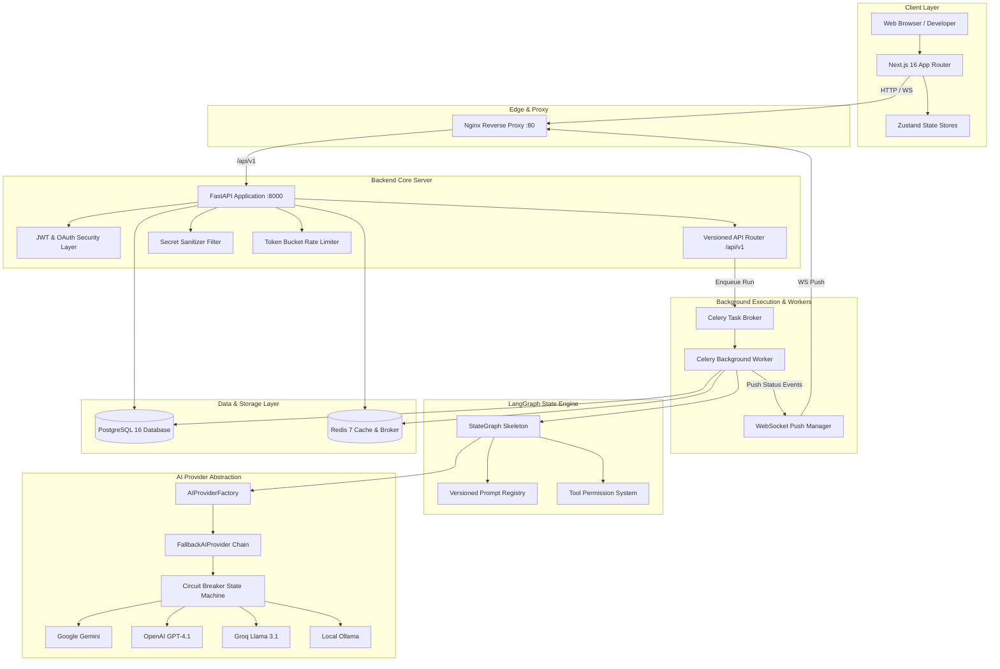
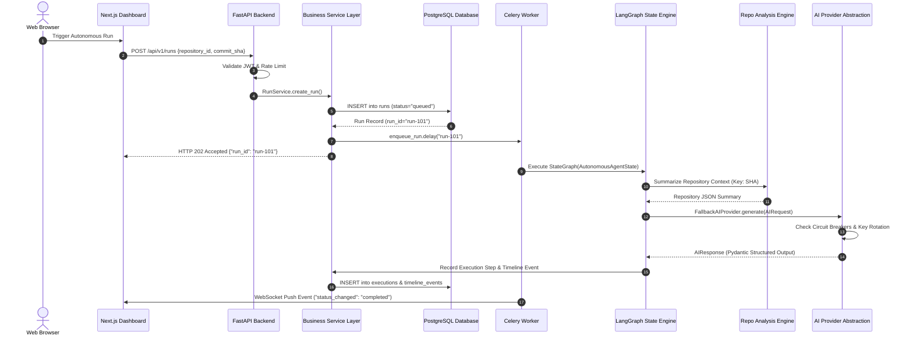
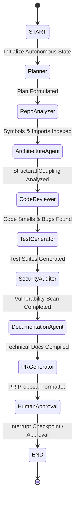
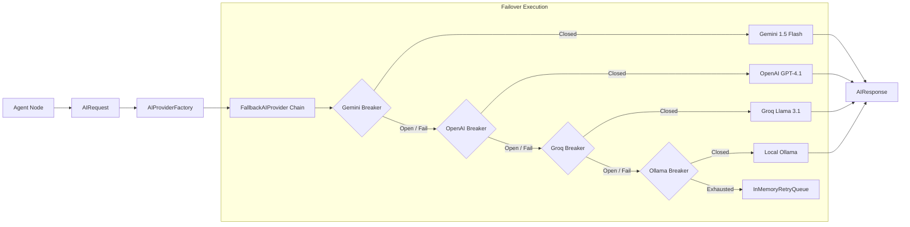
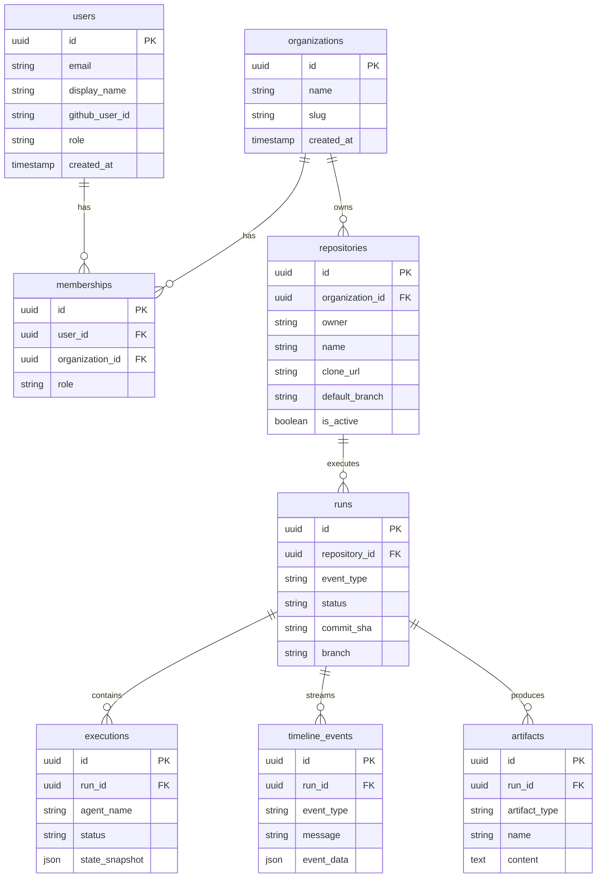
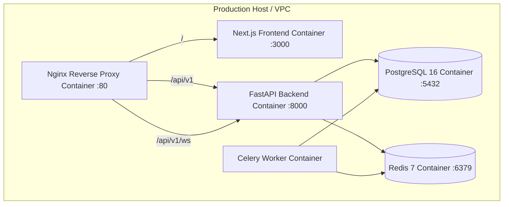
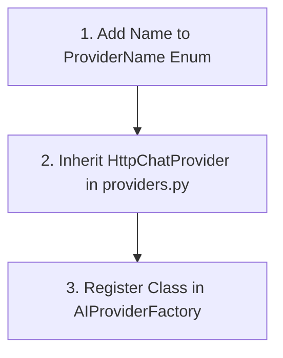

# Aegis AI: Architecture Documentation

> **Target Audience**: This document provides an in-depth architectural blueprint of the **Aegis AI** platform. It is written for software architects, principal engineers, and system designers seeking a complete understanding of system components, data flow, safety boundaries, and scaling characteristics.

---

## Table of Contents

1. [Overview](#1-overview)
2. [High-Level Architecture](#2-high-level-architecture)
3. [Request Lifecycle](#3-request-lifecycle)
4. [Backend Architecture](#4-backend-architecture)
5. [Frontend Architecture](#5-frontend-architecture)
6. [LangGraph Architecture](#6-langgraph-architecture)
7. [Provider Architecture](#7-provider-architecture)
8. [Repository Analysis Pipeline](#8-repository-analysis-pipeline)
9. [Security Architecture](#9-security-architecture)
10. [Database Architecture](#10-database-architecture)
11. [Deployment Architecture](#11-deployment-architecture)
12. [Scalability](#12-scalability)
13. [Extension Guide](#13-extension-guide)

---

# 1. Overview

The **Aegis AI** platform is an enterprise-grade, state-orchestrated multi-agent platform designed to automate codebase understanding, architectural analysis, code reviews, static security audits, documentation generation, and Pull Request preparation.

### Why Each Major Component Exists

| Component | Technology | Primary System Rationale |
| :--- | :--- | :--- |
| **Frontend Web App** | Next.js 16 (App Router) | Provides an accessible, responsive dashboard for connecting repos, triggering runs, and viewing real-time telemetry. |
| **API Gateway & Core Server** | FastAPI (Python 3.11+) | Delivers high-throughput asynchronous REST routes, WebSocket communication, JWT validation, and OpenAPI schemas. |
| **Orchestration Engine** | LangGraph (`StateGraph`) | Replaces unstructured LLM chatbots with a deterministic, state-machine agent pipeline. |
| **AI Provider Abstraction** | Custom Factory + Circuit Breakers | Decouples vendor APIs, enabling zero-code provider switching and resilient fallback failover. |
| **Codebase Analysis Engine** | AST + Static Scanners | Indexes repository trees, import graphs, and security vulnerabilities without executing untrusted code. |
| **Asynchronous Task Queue** | Celery + Redis | Offloads heavy repository ingestion and multi-step agent reasoning from the main API thread. |
| **Relational Storage** | PostgreSQL 16 + AsyncPG | Stores persistent application entities, runs, executions, artifacts, and user memberships. |
| **Cache & Event Broker** | Redis 7 | Serves as the Celery message broker and caches SHA-keyed repository summaries. |
| **Reverse Proxy** | Nginx | Terminates SSL, routes REST and WebSocket traffic, and enforces network boundaries. |

---

# 2. High-Level Architecture



---

# 3. Request Lifecycle

The diagram below outlines the end-to-end request flow for a repository run execution:



---

# 4. Backend Architecture

The backend ([backend/app](file:///d:/Codex%20Hackathon/backend/app)) enforces a strict **Layered Architecture**:

```
FastAPI Routers (/api/v1/routers/)
       │
       ▼
Dependencies Layer (app/api/dependencies.py)
       │
       ▼
Service Layer (app/services/)
       │
       ▼
Repository Data Access Layer (app/repositories/)
       │
       ▼
Database Engine (app/db/session.py -> Async SQLAlchemy + AsyncPG)
```

### Layer Breakdown

1. **Routers Layer** ([app/api/v1/routers](file:///d:/Codex%20Hackathon/backend/app/api/v1/routers)): Versioned REST API routers and WebSocket handlers. Routers contain zero SQL queries or complex business logic.
2. **Services Layer** ([app/services](file:///d:/Codex%20Hackathon/backend/app/services)): Business logic services (`AuthService`, `RepositoryService`, `RunService`, `WebhookService`, `WebSocketManager`) encapsulating data mutations and cross-service orchestration.
3. **Repository Layer** ([app/repositories](file:///d:/Codex%20Hackathon/backend/app/repositories)): Generic async CRUD repositories (`BaseRepository[T]`, `UserRepository`, `RepositoryRepository`, `RunRepository`) isolating SQLAlchemy ORM queries.
4. **Database Layer** ([app/db](file:///d:/Codex%20Hackathon/backend/app/db)): Async engine and session factory (`async_sessionmaker`) connecting to PostgreSQL via `asyncpg`.
5. **Workers Layer** ([app/workers](file:///d:/Codex%20Hackathon/backend/app/workers)): Celery background task processing and `DeadLetterTask` failure handlers.
6. **Providers Layer** ([app/ai](file:///d:/Codex%20Hackathon/backend/app/ai)): Abstract LLM providers (`BaseAIProvider`, `HttpChatProvider`), concrete vendor drivers, fallback chains, circuit breakers, and key rotation rings.

---

# 5. Frontend Architecture

The frontend ([frontend/](file:///d:/Codex%20Hackathon/frontend)) is constructed with Next.js 16 App Router, React 19, TypeScript, Tailwind CSS, Zustand, and React Query:

```
Next.js Root Layout (app/layout.tsx)
       │
       ▼
QueryProvider Client Wrapper (providers/QueryProvider.tsx)
       │
       ▼
AppShell Component (components/layout/AppShell.tsx)
       │
       ├──► Header Navbar (Navbar.tsx)
       ├──► Repository List Panel (RepositoryList.tsx)
       ├──► Telemetry & Cost Panel (AnalyticsPanel.tsx)
       ├──► GitHub OAuth Login Modal (LoginModal.tsx)
       └──► Connect Repo Modal (ConnectRepoModal.tsx)
```

- **State Management**: `useAuthStore` manages JWT tokens and user profiles; `useRepoStore` manages selected repositories and active navigation tabs (`repositories`, `timeline`, `graph`, `reviews`, `architecture`, `analytics`).
- **API Client Layer** ([src/lib/api.ts](file:///d:/Codex%20Hackathon/frontend/src/lib/api.ts)): Centralized fetch client injecting Bearer JWT headers.

---

# 6. LangGraph Architecture

The orchestration engine defines a 9-node `StateGraph` skeleton ([graph.py](file:///d:/Codex%20Hackathon/backend/app/agents/graph.py)) executing the following pipeline:



### Agent Node Responsibilities

1. **Planner**: Analyzes repository summary to formulate high-level execution goals.
2. **Repository Analyzer**: Indexes directory trees, import graphs, and symbol inventories.
3. **Architecture Agent**: Evaluates design patterns, component coupling, and structural debt.
4. **Code Reviewer**: Reviews static code metrics and style compliance to highlight code smells.
5. **Test Generator**: Formulates automated Pytest unit and integration test suites.
6. **Security Auditor**: Analyzes Bandit and Semgrep scans for vulnerabilities.
7. **Documentation Agent**: Compiles technical markdown documentation and changelogs.
8. **PR Generator**: Formulates Pull Request titles, descriptions, and file edit proposals.
9. **Human Approval**: Interrupt checkpoint pausing graph execution for explicit human authorization.

---

# 7. Provider Architecture

### Multi-Provider Fallback Chain
The AI abstraction layer enforces vendor-agnostic chat completions, streaming, and Pydantic structured output:



- **Circuit Breaker State Machine**: Each provider tracks failure counts. When failures reach `ai_circuit_failure_threshold` (default 3), the breaker trips to `OPEN`. After `ai_circuit_cooldown_seconds` (default 30s), it enters `HALF_OPEN` to probe recovery.
- **ApiKeyRing**: Round-robin API key rotation manager cycling through provider credentials.

---

# 8. Repository Analysis Pipeline

```
Codebase Repository
  │
  ├─► DirectoryTreeService ────► Filter out sensitive files (.env, .pem, id_rsa)
  │
  ├─► ReadmeService ───────────► Extract README overview text
  │
  ├─► TreeSitterAstService ────► Discover AST parse targets across languages
  │
  ├─► ImportGraphService ─────► Parse Python AST imports & top-level symbols
  │
  ├─► GitHistoryService ──────► Extract recent commit metadata with GitPython
  │
  └─► StaticAnalysisService ───► Run Ruff, Bandit, Semgrep, Radon (shell=False)
  │
  ▼
RepositorySummarizer ─────────► Synthesize Summary JSON & Cache in Redis (Key: SHA)
  │
  ▼
LangGraph Engine ─────────────► Inject Structured Summary into Agent Nodes
```

---

# 9. Security Architecture

- **JWT Authentication**: Signed using `HS256` with a 32-byte secret key ([security.py](file:///d:/Codex%20Hackathon/backend/app/core/security.py)).
- **GitHub Webhook Signatures**: Constant-time HMAC SHA256 verification (`verify_github_signature`) against raw request bodies before JSON parsing.
- **Role-Based Access Control (RBAC)**: Role hierarchy (`OWNER` > `ADMIN` > `MEMBER` > `VIEWER`) enforced via `require_role(...)` dependencies.
- **Secret Sanitizer**: `SecretSanitizer` ([sanitizer.py](file:///d:/Codex%20Hackathon/backend/app/core/sanitizer.py)) redacts API keys, GitHub tokens, Bearer tokens, and passwords from logs and AI payloads.
- **Process Sandboxing**: Static analysis tools run asynchronously via `asyncio.create_subprocess_exec` with `shell=False`, strict timeouts, and path containment checks (`safe_relative_path`).
- **Rate Limiting**: Token bucket middleware (`RateLimiter`) enforcing 120 requests/min per IP.

---

# 10. Database Architecture



---

# 11. Deployment Architecture



---

# 12. Scalability

1. **Stateless API Gateway**: FastAPI backend nodes are completely stateless. HTTP requests scale horizontally behind load balancers.
2. **Distributed Asynchronous Workers**: Celery background workers scale independently to handle heavy repository indexing and multi-agent reasoning.
3. **Redis Caching**: Deterministic repository summaries are cached in Redis keyed by commit SHA, reducing redundant codebase parsing.
4. **Async Connection Pooling**: PostgreSQL connections use `asyncpg` connection pools (`pool_size=10`, `max_overflow=20`), preventing connection exhaustion.

---

# 13. Extension Guide

### Adding a New LLM Provider



1. **Add to Enum** (`app/ai/schemas.py`):
   ```python
   class ProviderName(StrEnum):
       NEW_VENDOR = "new_vendor"
   ```
2. **Implement Driver** (`app/ai/providers.py`):
   ```python
   class NewVendorProvider(HttpChatProvider):
       def __init__(self, api_keys: list[str], model: str) -> None:
           super().__init__(
               name=ProviderName.NEW_VENDOR,
               base_url="https://api.newvendor.com/v1",
               default_model=model,
               keyring=ApiKeyRing(api_keys),
           )
   ```
3. **Register in Factory** (`app/ai/factory.py`): Add mapping entry in `_provider_map()`.

### Adding a New API Endpoint
1. Declare request/response schemas in `app/schemas/`.
2. Implement router function in `app/api/v1/routers/`.
3. Register router in `app/api/v1/router.py`.
